# School_District_Analysis
## Overview of the school district analysis
The purpose of this analysis is to analyze the difference between standardized testing scores within a school district after removing bad information within the dataset.
## Results
- The district summary was affected in various ways after fixing the dataframes, but the results did not change by a significant amount. The total student count did decrease a small amount, however the testing results and the percentage of students passing the subjects did not change significantly.
  - Original District Results
   
   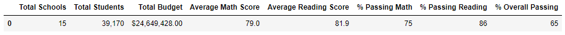
  - Adjusted District Results
    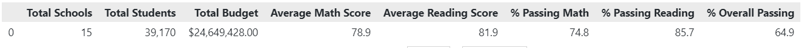
- The school summary was not affected in a significant way by removing the test scores of the 9th graders and adjusting the amount of students.
  - Original School Results
    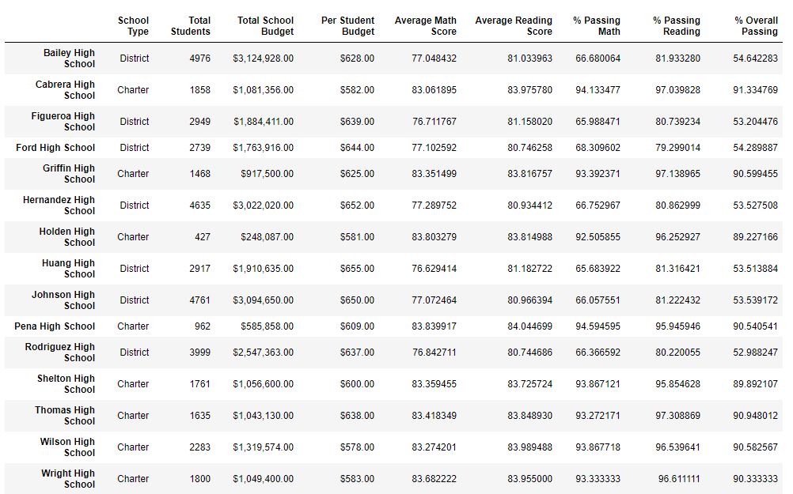
  - Adjusted School Results
    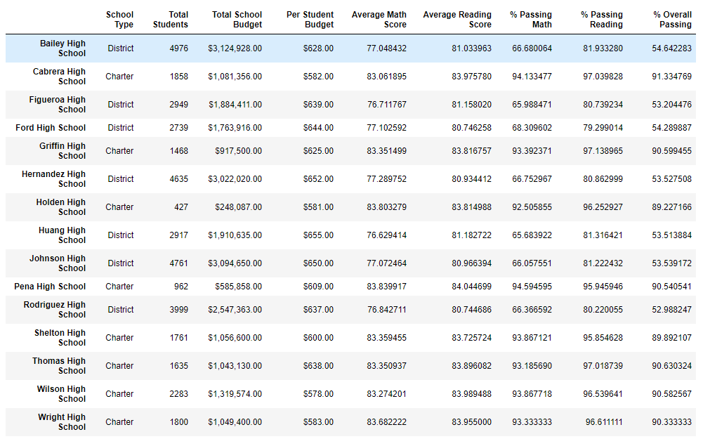
- Replacing the ninth graders’ math and reading scores did not affect Thomas High School’s performance relative to the other schools in a significant manner. The mean's and percentages did not show significant variance.
- When we replace the ninth grade scores, it only affects the 9th grade cell for reading and math scores. All the other scores stay the same.
  - Original Math Results by Grade
    
    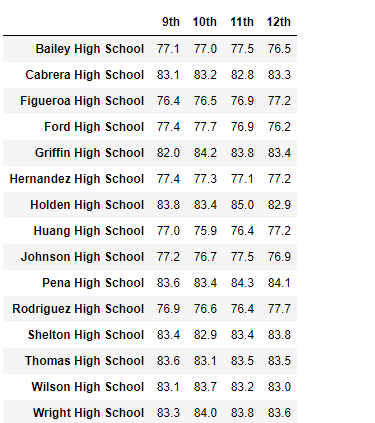
  - Original Reading Results by Grade
    
    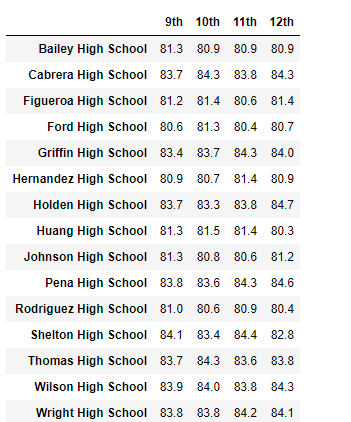
  - Adjusted Math Results by Grade
    
    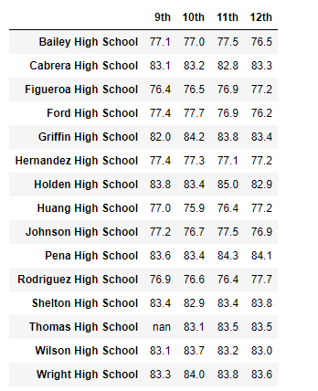
  - Adjusted Reading Results by Grade
    
    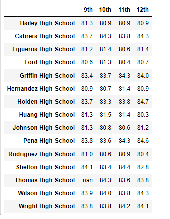
- Scores by school spending was not affected by replacing the 9th grade scores.
  - Original Scores by Spending
  
    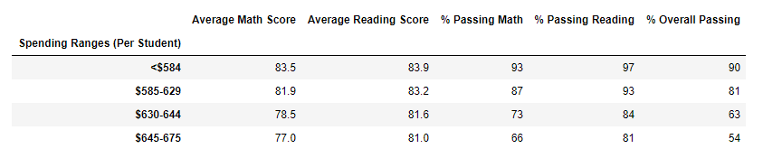
    
  - Adjusted Scores by School Spending
    
    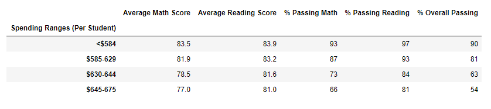
- Scores by School size were also not affected by replacing the 9th grade scores.
  - Original Score by School Size
  
    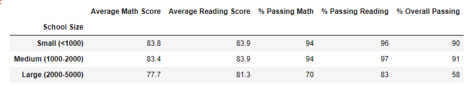
  - Adjusted score by School Size
  
    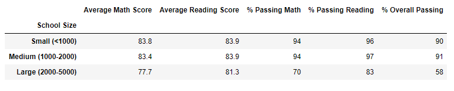
- Scores by school type was also not affect by replacing the 9th grade scores.
  - Original Scores by School Type
    
    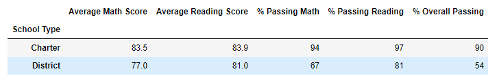
  - Adjusted Score by School type
    
    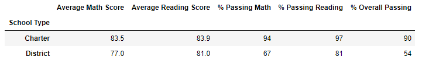
## Summary
I did not find major changes to the results when we removed the 9th grade students results. The only things that really changed was the number of students we were counting. From there, the data shows that the majority of results stayed pretty much the same. The overall passing percentage in Thomas High School, but it was less than 1%, so it was not a significant amount. All in all, it looks like removing the 9th grade results did not affect the findings in a significant manner.
